# Barangay Profiling System — Implementation Guide

## 1. System Overview
The web-based **Barangay Profiling System** is built using **Python Django** and configured for **MySQL** (with smart SQLite development fallback). It focuses on the primary operational lifecycle of household and resident data gathering in a Philippine Barangay office.

---

## 2. Core Profiling Flow

```mermaid
graph TD
    A[Login: Admin / Staff] --> B[Dashboard Summary]
    B --> C[House Visit: Household Profiling Form]
    C --> D[Add Resident Members to Household]
    D --> E[Staff: Submit for Verification]
    E --> F[Admin: Review & Verify Queue]
    F -->|Approve| G[Approved & Verified Barangay Record]
    F -->|Return| H[Returned for Correction with Remarks]
    H --> C
    G --> I[Official Masterlists & Demographic Reports]
```

---

## 3. Implemented Modules & Features

### 1. Authentication & Role-Based Access
- **Secure Official Login**: Accessible at `/login/` for authorized barangay personnel.
- **Admin Role** (`is_superuser` / `role='Admin'`):
  - Review, approve, and return household profiles.
  - Full CRUD permissions over household and resident records.
  - Access demographic analytics, masterlists, and export tools.
  - User Management: create and activate/deactivate staff and admin accounts.
- **Barangay Staff Role** (`is_staff` / `role='Staff'`):
  - Field survey entry: create household profiles (starts as `Draft`).
  - Add resident members belonging to each household.
  - Edit draft or returned profiles.
  - Click **Submit for Verification** to advance profiles to `Pending Verification`.

### 2. Executive Dashboard (`/dashboard/`)
- **Metric Cards**:
  - Total Households
  - Total Residents
  - Male Residents
  - Female Residents
  - Pending Verification Profiles
  - Verified Profiles
- **Number of Households per Purok**: Interactive table displaying household and resident counts across all puroks.
- **Recent Profiling Activity**: Direct links to recently updated households.

### 3. Household Profiling (`/households/`)
- **Household Form Fields**:
  - Household ID / Number (e.g. `HH-2026-001`)
  - Purok (Purok 1 through Purok 10)
  - Complete Address
  - Householder / Head of Family
  - Contact Number
  - Number of Household Members
  - Type of House (*Concrete, Semi-Concrete, Wood, Bamboo/Light Materials, Makeshift*)
  - Housing Ownership (*Owned, Rented, Living with Relatives, Informal Settler, etc.*)
  - Water Source (*Level III Piped, Level II Communal, Level I Well, Refilling Station*)
  - Electricity (*Legal Connection, Shared Meter, Solar, Generator, None*)
  - Toilet Facility (*Water-sealed Flush, Pour-flush, VIP Latrine, Open Pit, None*)
  - Household Status (*Active, Inactive, Relocated*)
  - Verification Status (*Draft, Pending Verification, Approved, Returned for Correction*)

### 4. Resident Information (`/residents/`)
- Direct One-to-Many relationship (`Household` $\rightarrow$ `Resident`).
- **Resident Fields**:
  - Resident ID (e.g. `RES-0001`)
  - First Name, Middle Name, Last Name, Full Name
  - Birth Date, Age, Sex, Civil Status
  - Relationship to Household Head (*Head, Spouse, Son, Daughter, Parent, Sibling, etc.*)
  - Educational Attainment (*Elementary, High School, College, TVET, Post-Grad*)
  - Occupation & Employment Status (*Employed, Self-Employed, Unemployed, Student, etc.*)
  - Contact Number & Residency Status (*Permanent, Temporary, Transferred, Deceased*)

### 5. Profile Verification Workflow (`/verification/`)
- Admin queue with dedicated status tabs: **Pending Verification**, **Approved Profiles**, **Returned for Correction**, and **Drafts**.
- Admin can review all living amenities and household residents in one view.
- Actions:
  - **Approve**: Sets status to `Approved`, records admin verifier and timestamp.
  - **Return for Correction**: Attaches admin remarks/notes explaining required edits.

### 6. Household & Resident Masterlists
- Multifaceted search and filtering:
  - Search by Name, Household No., Purok, and Head of Family.
  - Filters by Purok, Sex, Age Group (Children 0-14, Youth 15-24, Adults 25-59, Seniors 60+), Civil Status, and Verification Status.
- One-click export to CSV for spreadsheets and municipal submissions.

### 7. Reports & Analytics (`/reports/`)
- Household Masterlist summary
- Resident Masterlist summary
- Population & Households by Purok (table + percentage progress bars)
- Male and Female population distribution
- Age Group Distribution & Household Size breakdown
- Housing characteristics & sanitation summary
- Print layout with clean CSS `@media print` styling

### 8. Secondary Resident Concerns (`/concerns/`)
- Kept strictly as a secondary feature.
- Workflow: File Concern $\rightarrow$ Status (*Pending, Under Review, In Progress, Resolved, Rejected*) $\rightarrow$ Action Taken notes.

### 9. User Management (`/users/`)
- Admin-only interface to create and manage authorized staff and admin accounts.

---

## 4. Database Setup (MySQL & SQLite)
In `barangay_project/settings.py`, the database is configured to connect to MySQL automatically when available:
- **Database Name**: `barangay_db`
- **Host**: `127.0.0.1` (Port: `3306`)
- **User**: `root`
- **Password**: `""` (or via environment variables: `DB_NAME`, `DB_USER`, `DB_PASSWORD`, `DB_HOST`, `DB_PORT`)
- If MySQL is not running locally, it seamlessly falls back to SQLite so development and testing continue without downtime.

---

## 5. Default Credentials
| Role | Username | Password |
|---|---|---|
| **Barangay Administrator** | `admin` | `admin123` |
| **Field Profiling Staff** | `staff` | `staff123` |
